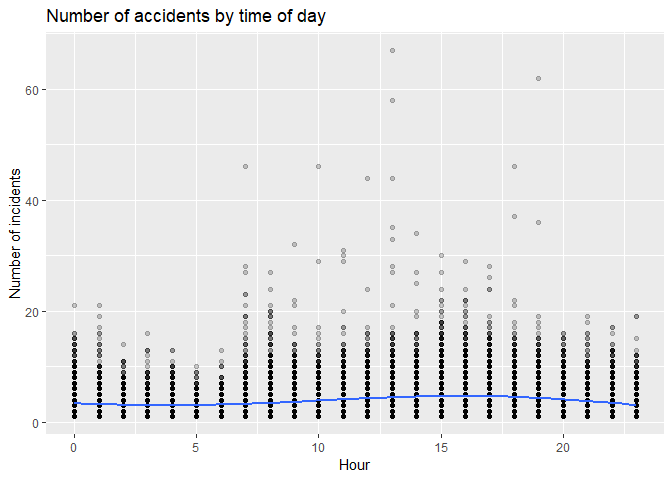
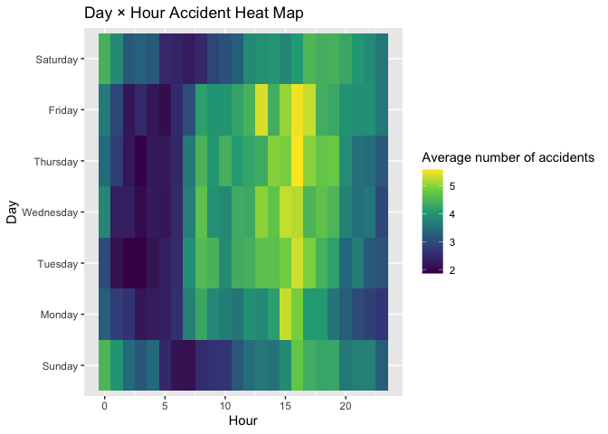
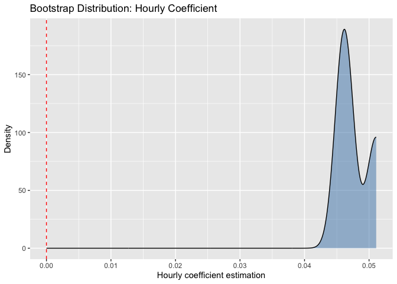
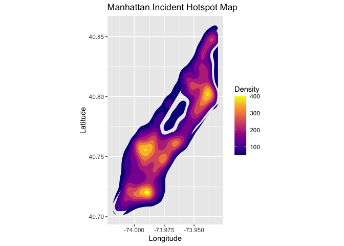

Linear Regression
================
2025-12-02

## Download Data

``` r
Data<-read_csv("./Data/collision_df.csv")
```

    ## Rows: 112451 Columns: 25
    ## ── Column specification ─────────────────────────────────────────────────────
    ## Delimiter: ","
    ## chr   (9): day_of_week, vehicle_type, driver_license_status, driver_license_...
    ## dbl  (15): collision_id, vehicle_id, person_id, year, month, day, hour, zip_...
    ## time  (1): crash_time
    ## 
    ## ℹ Use `spec()` to retrieve the full column specification for this data.
    ## ℹ Specify the column types or set `show_col_types = FALSE` to quiet this message.

## data.tidy

``` r
Data_clean <- Data %>%
mutate(
crash_time = as.character(crash_time),
crash_time = ifelse(nchar(crash_time) == 5, paste0(crash_time, ":00"), crash_time),
datetime = ymd_hms(paste(year, month, day, crash_time)),
hour = hour(datetime),
weekday = wday(datetime, label = TRUE, abbr = FALSE),
month = month(datetime, label = TRUE, abbr = FALSE),
weekend = ifelse(weekday %in% c("Saturday","Sunday"), 1, 0),
date = date(datetime)
) %>%
drop_na(datetime)
```

## Hourly Accident Statistics

``` r
hourly_df <- Data_clean %>%
mutate(datetime_hour = floor_date(datetime, "hour")) %>%
count(datetime_hour, name = "num_crash") %>%
mutate(
hour = hour(datetime_hour),
weekday = wday(datetime_hour, label = TRUE, abbr = FALSE, locale = "en_US"),
month = month(datetime_hour, label = TRUE, abbr = FALSE, locale = "en_US"),
year = year(datetime_hour),
weekend = ifelse(weekday %in% c("Saturday","Sunday"), 1, 0)
)
```

## Linear Regression Models

``` r
ggplot(hourly_df, aes(hour, num_crash)) +
geom_point(alpha = 0.2) +
geom_smooth(method = "loess") +
labs(
title = "Number of accidents by time of day",
x = "Hour",
y = "Number of incidents"
)
```

    ## `geom_smooth()` using formula = 'y ~ x'

<!-- -->

``` r
hour_weekday_heat <- hourly_df %>%
group_by(weekday, hour) %>%
summarise(mean_crash = mean(num_crash), .groups = "drop")

ggplot(hour_weekday_heat, aes(hour, weekday, fill = mean_crash)) +
geom_tile() +
scale_fill_viridis_c() +
labs(title = "Day × Hour Accident Heat Map", x = "Hour", y = "Day", fill = "Average number of accidents")
```

<!-- -->

Ans: fit1: base model: hour, weekday, month. fit2: add the interaction
between hour and weekday. fit3: add the year variable.

Conclusion: Multiple incidents primarily occurred during the morning
rush hour starting at 7 a.m. and continuing until 7 p.m., with
particularly high concentrations during the morning and evening peak
periods. The period from noon to 2 p.m. also showed significant
activity, likely due to midday commuting patterns.

## Cross Validation

``` r
set.seed(123)

cv_splits <- vfold_cv(hourly_df, v = 2)

model_spec <- linear_reg() %>%
set_engine("lm")

wf1 <- workflow() %>%
add_formula(num_crash ~ hour + weekday + month) %>%
add_model(model_spec)

wf2 <- workflow() %>%
add_formula(num_crash ~ hour * weekday + month) %>%
add_model(model_spec)

wf3 <- workflow() %>%
add_formula(num_crash ~ hour + weekday + month + year) %>%
add_model(model_spec)

cv1 <- fit_resamples(wf1, cv_splits, control = control_resamples(save_pred = TRUE))
cv2 <- fit_resamples(wf2, cv_splits, control = control_resamples(save_pred = TRUE))
cv3 <- fit_resamples(wf3, cv_splits, control = control_resamples(save_pred = TRUE))

cv1_metrics <- collect_metrics(cv1)
cv2_metrics <- collect_metrics(cv2)
cv3_metrics <- collect_metrics(cv3)

cv1_metrics
```

    ## # A tibble: 2 × 6
    ##   .metric .estimator   mean     n std_err .config        
    ##   <chr>   <chr>       <dbl> <int>   <dbl> <chr>          
    ## 1 rmse    standard   3.03       2 0.0815  pre0_mod0_post0
    ## 2 rsq     standard   0.0201     2 0.00176 pre0_mod0_post0

``` r
cv2_metrics
```

    ## # A tibble: 2 × 6
    ##   .metric .estimator   mean     n std_err .config        
    ##   <chr>   <chr>       <dbl> <int>   <dbl> <chr>          
    ## 1 rmse    standard   3.03       2 0.0816  pre0_mod0_post0
    ## 2 rsq     standard   0.0205     2 0.00184 pre0_mod0_post0

``` r
cv3_metrics
```

    ## # A tibble: 2 × 6
    ##   .metric .estimator   mean     n std_err .config        
    ##   <chr>   <chr>       <dbl> <int>   <dbl> <chr>          
    ## 1 rmse    standard   3.03       2 0.0818  pre0_mod0_post0
    ## 2 rsq     standard   0.0213     2 0.00202 pre0_mod0_post0

Ans: Among the three models, fit3 (containing hour + weekday + month +
year) is the optimal model. Although the improvement is modest, it
achieves the best performance on cross-validation metrics. Among the
three candidate models, model 3 (hour + weekday + month + year) is
selected as the optimal model. This conclusion is based on
cross-validation performance. Specifically, model 3 attains the lowest
average RMSE and the highest average R² across the 10 folds, indicating
slightly better predictive accuracy and explanatory power compared with
models 1 and 2. Although the improvement is modest, the performance
gains are consistent across folds, suggesting that the inclusion of the
year term provides additional predictive value without increasing model
variance. Therefore, model 3 is the best-performing model among the
three.

## Bootstrap

``` r
boot_df <- hourly_df %>%
rsample::bootstraps(times = 1000) %>%
mutate(
model = map(splits, ~ lm(num_crash ~ hour + weekday + month, data = analysis(.x))),
coef = map(model, broom::tidy)
) %>%
unnest(coef)

boot_df %>%
filter(term == "hour") %>%
ggplot(aes(x = estimate)) +
geom_density(fill = "steelblue", alpha = 0.5) +
geom_vline(xintercept = 0, color = "red", linetype = "dashed") +
labs(title = "Bootstrap Distribution: Hourly Coefficient", x = "Hourly coefficient estimation", y = "Density")
```

<!-- -->

Ans: The hourly coefficient is approximately 0.04–0.055, meaning that
for every additional hour, the average number of accidents increases by
about 0.04–0.055 incidents. Based on 1,000 bootstrap resamples, the
estimated coefficient for hour is highly stable and concentrates within
the range 0.04–0.055. This indicates a small but consistent positive
relationship between the time of day and the number of crashes. In
practical terms, each additional hour is associated with an increase of
approximately 0.04–0.055 accidents on average, holding other variables
constant. The tight bootstrap distribution suggests that the effect is
statistically reliable, even if the magnitude is modest.

## Spatial Heat Map (Incident Hotspots)

``` r
manhattan_df <- Data_clean %>%
filter(latitude >= 40.7 & latitude <= 40.88,
longitude >= -74.02 & longitude <= -73.93)


ggplot(manhattan_df, aes(x = longitude, y = latitude)) +
stat_density_2d(aes(fill = ..level..), geom = "polygon", contour = TRUE) +
scale_fill_viridis_c(option = "plasma") +
coord_fixed() +
labs(title = "Manhattan Incident Hotspot Map", x = "Longitude", y = "Latitude", fill = "Density")
```

<!-- -->
