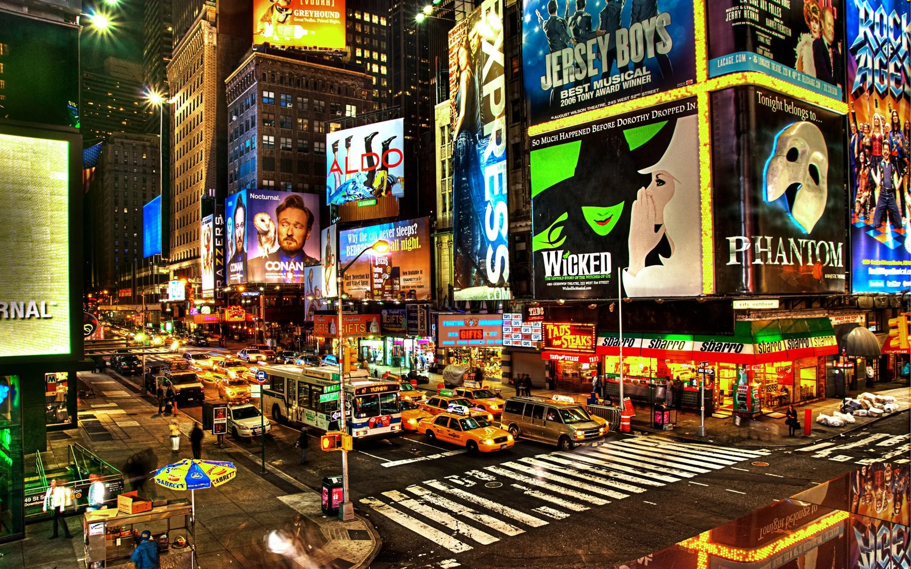

::: {style="text-align:center;"}

:::

## Background

New York City's streets support intense, around-the-clock movement of vehicles, cyclists, and pedestrians. In Manhattan especially, high traffic density combines with frequent intersections and mixed road users to create persistent safety challenges. Even in years when the raw number of collisions does or does not change, risk is rarely uniform: Collisions may cluster in commute hours, late nights, weekends, or particular seasons; they can also concentrate in specific corridors and intersections.

## Why this matters

Understanding when and where collisions happen most can help translate raw incident records into actionable insights. For city agencies and communities, identifying time windows of high risk and hotspot locations can support targeted interventions, including adjusting enforcement schedules, improving signage and street design, refining public safety messaging, and optimizing emergency response planning.

