# Introduction

## Motivation

Traffic accidents in NYC continue to be a problem concerning the health of the public as well as urban planners. In relation to the number of traffic accidents in NYC, the number of people affected by traffic accidents in the NYC area also needs to be established. Additionally, the number of locations that have the highest traffic accidents in relation to the lowest also needs to be established. Additionally, the disparities in the severity of traffic accidents also need to be established. Data for our dataset will relate to the Manhattan traffic accidents from January 2021 to October 2025. An interactive visual tool will also be developed to demonstrate clearly the trends of traffic accidents concerning the year. Additionally, the descriptive statistics of the affected individuals concerning their ages, gender, role in the vehicle, ejection from the vehicle, as well as locations in the neighborhood also needs to be established.

## Inspiration

As someone living in the area around Times Square, traffic safety cannot be ignored. A typical day of the week involves the intersection in the area around Times Square being full of cars, buses, delivery trucks, cyclists, and throngs of pedestrians all vying for the same intersections. Even before something “significant” happens in the vicinity of Times Square, you see a slate of close calls daily: cars abruptly turning into intersections, automobiles inching into pedestrian paths in intersections, pedestrians entering traffic when the traffic signal is changing, or the occasional angry driver in a traffic jam. This was the problem we set out to solve.

We also considered the existing approach in New York City of considering traffic injury prevention a high policy goal for [Vision Zero](https://www.nyc.gov/content/visionzero/pages/). This policy considers the loss of lives and serious injuries preventable. They also measure their progress in the three Es: Engineering, Enforcement, Education, and Legislation. Vision Zero considers strategies in pinpointing high injury locations. Naturally for our consideration to create an interactive map in Shiny to allow the filtering of injuries based on the severity level of the year; for purposes of context and validation of the approach taken by NYC in Vision Zero View. They offer insights into how NYC makes injuries/fatalties aggregated in their map.

## Initial Questions

1. When do collisions in Manhattan happen most frequently (hour-of-day, day-of-week, seasonal patterns)?

2. Where are collision hotspots in Manhattan, and do hotspots differ by time window?

3. Can we move beyond simple counts to identify high-risk windows that could support traffic management and safety planning?

## How the questions evolved during the project

1. From "all NYC" to "Manhanttan only": to align with our lived motivation (Times Sqaure / Midtown area).

2. From crash counts only -> to severity- and person-oriented questions: once we examined person-level atrributes (sex, age, role) and outcome, rarity (ejection/entrapment), we added questions about who is involved and how severe the outcomes are, not only where/when crashes occur.
  
## New questions considered during analysis

1. How do injury severity patterns differ across age groups (e.g., do children/teens have a higher share of severe outcomes even if they appear less often overall)?

2. Are there strong composition patterns (e.g., sex distribution, driver vs passenger distribution) that remain stable across neighborhoods?

3. Do “high-count” neighborhoods also appear as spatial clusters on the map, and does that change when filtering to “injury only” vs “death involved” events?

4. Given that severe outcomes (and especially ejection/entrapment) are rare events, what analytical strategies are appropriate (e.g., focusing on descriptive risk profiles vs. formal modeling with methods robust to class imbalance)?

# Methods

## Data

We used 3 NYC Motor Vehicle Collisions related dataset (Crashes, Vehicles, Person) collected from [NYC Open Data](https://data.cityofnewyork.us/browse?sortBy=relevance&pageSize=20&limitTo=datasets&q=NYC+Traffic+Accidents&page=1), but we only focused on the data of Manhanttan from Jan. 2021 to Oct.2025.

## Cleaning Process

Details are [here](data_clean.html).

# Results

## Temporal Analysis

**1) Collision Incidence**

For more details of hourly,monthly, yearly collision incidence for each severity, shiny graphs are shown [here](https://ls4236-shiny.shinyapps.io/Temporal_trend_shiny/#section-collision-incidence-bar).

Looking at the period of years 2021-2025 in Manhattan, there appear to be very strong and very persistent patterns in the number of collisions instead of random variation. There appear to be cycles in the months when the number of collisions per month is low during the Winter months (Jan-Feb in particular) but higher in the Spring months. They are highest in the late Spring/early Summer months (roughly around the months of May & June) but there also seems to be a peak in the Early Fall months (roughly around Sept-Oct) before tapering off at the end of the calendar year. There appear to be very steady cycles in the Week when the average number of collisions per day per Week day is highest for Tuesday to Friday in particular. Weekends show up lower but Sunday of all days is the safest day. There appear to be very strong cycles in the Hours of the day when the number of collisions per hour of the day during the “rush hours” for a day when the number of collisions per hour of the day increases dramatically to peak in the late Afternoon & Early Evening Hours (roughly around 3-5pm) in particular before tapering off in the late hours of the Night. There also seems to exist a strong counterpart to the above cycles for the “minor & medium” injury collisions. The more severe ones (Fatal) appearing to be relatively “rare & noisy” but also appear to occur in the peak hours of maximum “Exposure” or sometimes in the later hours of the Night when perhaps the “risk per hour of exposure” may be higher.

**2) Casualty Persons**

For more details of hourly,monthly, yearly casualty persons boxplots for each severity, shiny graphs are shown [here](https://ls4236-shiny.shinyapps.io/Temporal_trend_shiny/#section-casualty-persons-boxplot).

Over the period 2021-2025, there is a strong right skew in the distribution of casualties per event. That is, in all months of the year, on all days of the week, and at all hours of the day, the median/most common number of casualties per incident is about 1 but there occur a few events of multi-casualty nature. Looking at the monthly figures, there seems to be a strong seasonality in the distribution of casualties in a month. This also seems to reflect a strong periodicity in the nature of the biggest events in a month. That is, the largest number of casualties tends to occur in a few months of the year. Looking at the figures for days of the week, the overall shape of the central parts of the distribution remains more or less the same. Some days of the week have a long tail compared to the rest. That is, some days of the week have a higher number of tail events. Looking at the hour of the day figures, the center of the distribution remains more or less the same. That is, the number of casualties per event remains small. Looking at the tail events of the figures for hours of the day, the events peak in the late afternoon to evening hours (15-20h) but there occur some morning peaks. That is, there seems to be a periodicity in the nature of the biggest events in a day.

**3) Incidence HeatMap**

For more details of hourly,monthly, yearly incidence heatmaps for each severity, shiny graphs are shown [here](https://ls4236-shiny.shinyapps.io/Temporal_trend_shiny/#section-incidence-heatmap).

There is strong spatial persistence in the risk of collision over the 21 heatmaps (separately for severity in 2021-2025): every year has the same main two locations, one in lower/central Manhattan (roughly long. between -74.00 & -73.97, lat. between 40.72 & 40.76) & another in the upper/east-midtown region (roughly between -73.96 & -73.93 long., 40.79-40.82 lat.) and a strong north-south “ridge” of higher density connecting them down the main traffic artery. Looking more specifically at the map for different severities of collision refines the picture: Non-Injury ‘Minor’ collisions follow the “All incidents” map pretty well but stretch over a wider area (many small events at many intersections around the city) & the ‘Medium’ Injury-Only events in particular center more tightly around the two main locations & the “ridge,” probably translated to meaning the busiest realms of intersectional activity also contain the greatest risk of injury; Severe ‘Death Involved’ collisions occur relatively rarely & the risk surface coalesces into one high point (fairly centrally located about mid-island at around long. -73.98 & lats. 40.75-40.77) & a somewhat secondary point less clearly separated (again perhaps due to sparsity & perhaps a reflection of a ‘few busy streets’ effect) but less distinctly differentiated between points. All locations of the risk-areas remain the same from one to another year but the degree to which they occur deviates annually, in particular seeming less widespread for the 2025 occurrence-year.

**4) Casualty Map**

For more details of hourly,monthly, yearly causalty maps for each severity, shiny graphs are shown [here](https://ls4236-shiny.shinyapps.io/Temporal_trend_shiny/#section-casualty-map).

Over the person-casualty events maps (2021-2025), there was a very strong geographical pattern of events being distributed over the Manhattan grid but being more concentrated in the more traffic-heavy central/southern parts of the island, in addition to the north-south arterials, but less in regions of lower intersection/roads (such as the larger park or waterfront regions) to show less events per cell. When a severity filter was applied to the events, the 'Minor (Non-Injury)' events map basically contains 0 person casualties per definition (summarized to a 0 map legend) to map the locations of non-injury events in place of the injury locations since they are abundant all over the place in direct correspondence to road exposure. 'Medium (Injury Only)' offers less but more localized delineations to infer injuries occurring in clusters on high-traffic intersections/roads. 'Severe (Death Involved)' events contain the least events visualized in form of sparse localized events dotting the map in form of isolated events for being less in number to form a continuous map of traffic events. Regarding geographical locations compared per year for all the events for 2021-2025 years, the events map core locations remain more or less the same but vary in strength in terms of the highest number of events per cellular location over years since the year 2025 seems less denser. Additionally, the legends defining colored intensities vary per map to make any comparative analysis strictly in terms of geographical locations very unreliable.

**5) Data Analysis**

This temporal analysis of Manhattan vehicle collisions from 2021 to 2025 demonstrates that accident frequency is highly predictable and strongly correlated with human activity patterns rather than random chance.

The data indicates a "Volume-Based Risk" model in which the collisions are most frequent at the times when the city is most alive: during the evening rush hours, towards the end of the workweek, during the warmer autumn months, and in years following the return of regular economic activity. Because of the parallel trends for Minor and Medium incidents, one might reason that interventions that simply reduced overall traffic volume or congestion during peak periods-specifically, the 4 PM-6 PM window and Thursday evenings-could effectively reduce the number of nuisance accidents and injury-causing crashes simultaneously.

  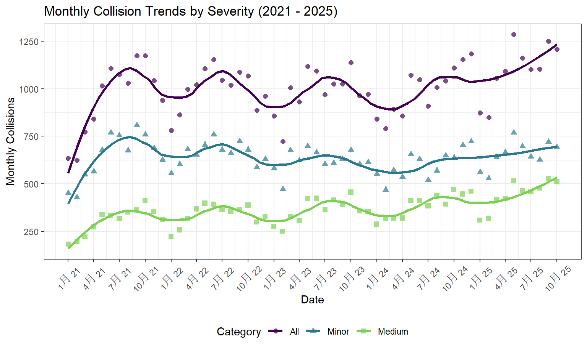
  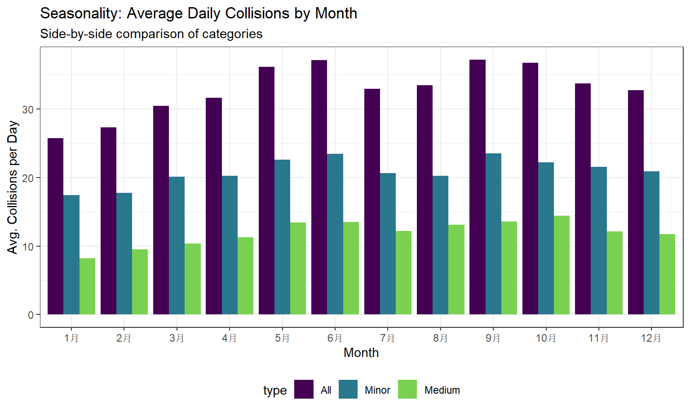

  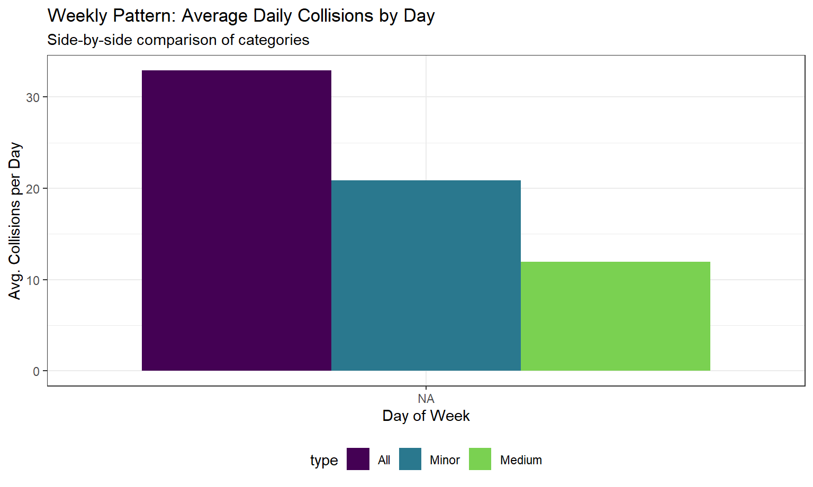
  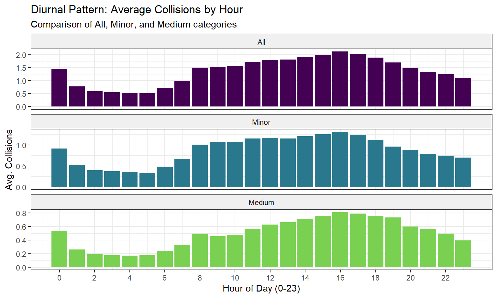

Detailed long-term, seasonal, weekly, diurnal analysis are shown [here](https://liliangsu103.github.io/p8105_final_project/Temporal_data_analysis.html).

**6) Predictive Model**

The result of the cross-validation process showed that the model with the additional lagged variables is the best for predicting the number of collisions per day. This is supported by the fact that the distribution of the RMSE for the model with the additional lagged variables is lower than that of the Baseline Model.

This enhancement on model performance is again reinforced by the comparison between the models on a more formal basis. From the ANOVA test result, inclusion of lag features is significant at p < 0.05, and therefore the features do incorporate relevant information above and beyond what is included in typical time series models. As a final assertion on the superiority and quality of the Improved Model for this task, beyond relative improvements, note that the AIC and BIC statistics being lower for the Improved Model imply that while the model has additional parameters, its efficiency is superior.

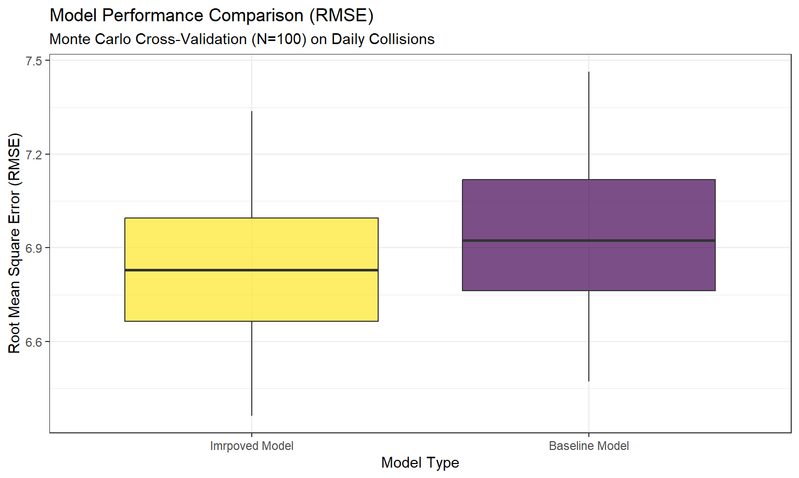

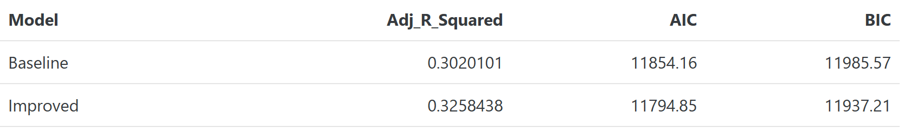

More details are shown [here](https://liliangsu103.github.io/p8105_final_project/Predictive_model.html).

## Non-temporal Analysis

Taken together, the evidence points to a pattern of collisions for adult age groups, followed by more serious injuries becoming proportionally more common with increasing age. 

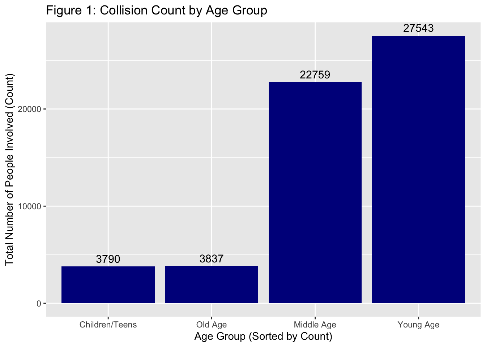

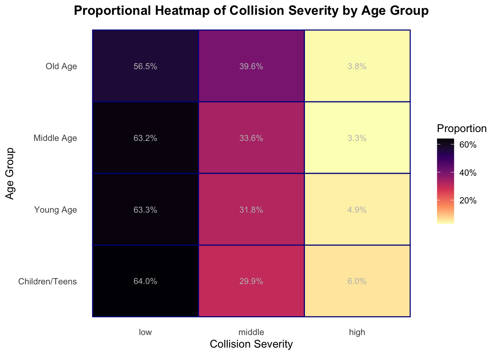

In terms of location, the majority of road traffic accidents occur in a small number of high-risk Manhattan communities.

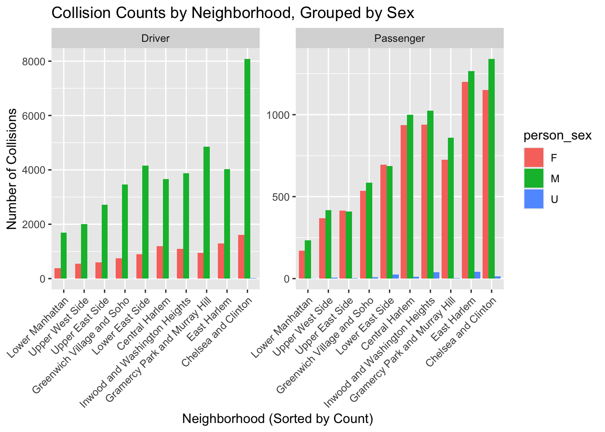

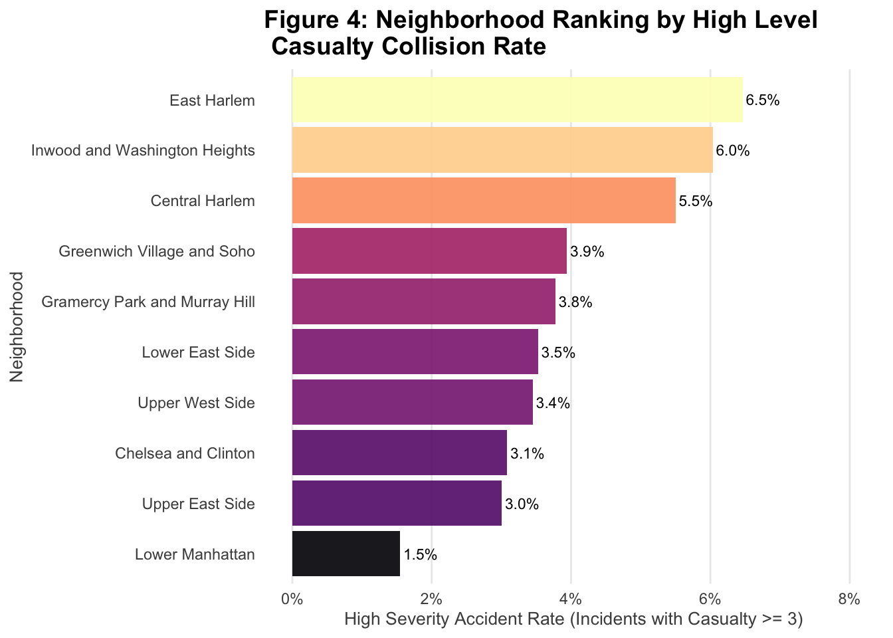

With respect to context, the majority of the accidents occur for sedan or SUV drivers. The risk chain graphics reveal that the factors of ejection/entrapment have a strong positive association for the risk of_fatal injuries despite being a relatively rare occurrence. 

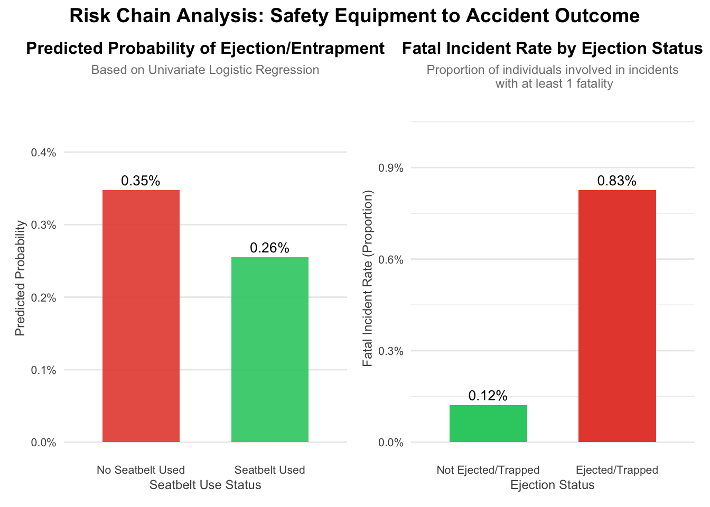

Details can be seen [here](Non_Temporal.html).

## Linear Regression

Over approximately 112k Manhattan crash records, you developed the time variables (hour/weekday/month/year) to analyze when and where crash activity clusters. A scatter/LOESS plot and the day& hour heatmap clearly reveal the crash activity cycles: there are relatively few crashes at night/early morning hours, a gradual increase in the wake of morning traffic, a persistent high level of activity throughout the day, followed by a second peak in the late afternoon/early evening hours (with the highest activity concentrations on Week-days). 

Concerning the model fitting, the inclusion of the structural temporal information makes a small positive difference in prediction quality—cross-validation RMSE of about 3.03 points with very small $R^2$ values (< 0.02), but the “fit3” model ( hour + weekday + month + year) performs best. The boostrap analysis indicates a small but positive and robust hour effect (residual hour coefficient around approximately 0.04-0.055). Spatially aggregated, the hotspot density map clearly detects that crashes occur in a non-uniform manner: a significant portion of them occur in a small number of high-traffic road links/areas in Lower Manhattan and a hotspot in Midtown. That suggests that crash activity results from busy activity/congestion, in particular in Week-days.

Details can be seen [here](Linea_Regression.html).

# Discussion

Looking at the aggregated maps of casualties over years, there seems to be a characteristic “high-frequency/low-severity” distribution in Manhattan communities: the location of non-casualty and medium-grade incidents (both non-injury and injury-only) is very dense throughout the grid, while high severity incidents (death-related) occur sparsely. The level of severity makes a big difference in interpreting the map-pattern. The present map of severe events contains a significantly smaller number of events than the rest of the map set. “Those events may appear very patchy,” even if risk factors remain relatively equal. Contrasting the metrics of the three types of events whose locations have been plotted in the map, there appears to be a clear positive correspondence between locations of highest events density and the busiest locations in Manhattan.

These results for temporal modeling support the narrative. The hourly scatter plot and day by hour Heat Map illustrate strong activity cycles by hour of day, peaking from the morning into the day hours (late morning to evening) when commuting hours occur. Including temporal indicators for hour of day, weekday vs. weekends, month of year, and the year itself improves the model somewhat: Cross-validation yields a very small change to the RMSE of around 3.0 for all candidate models, while $R^2$ values remain extremely low (<.02); conversely, a small hour effect exists (bootstrap SD of the hour coefficient of around 0.04-0.055 more per hour) but is small in magnitude. In practical terms, when taken together with the strong hour of day effect already mentioned, the hour effect may point to the importance of unmodeled factors (enforcement activity times, weather conditions, special events, road designs, etc.).

Spatially, the hotspot map of the incident hotspot (KDE) exhibits the presence of “hot zones” instead of risk uniformity, as in repeatedly exposed high-density business districts and high-trauma road locations. The analysis of the hotspot locations together with the rarity of the occurrence of lethal events identifies two paths for the prevention approach: (1) a system-level approach to decrease frequent minor/crash events in high-volume roads, and (2) severity prevention measures in locations where the topographic characteristics have the tendency to transform a rare event into a possible disastrous one. Finally, the “descriptive causality” summaries (characteristics of vehicle/person type & safety equipment use) offer viable mechanisms: the results seem to be dominated by typical vehicle types & person roles in them, while the majority of individuals appear to have used safety equipment, although a significant proportion have not. Taken together, the findings offer a sensible conclusion: Manhattan crash casualties relate to exposure (concentration of vehicle travel when & where), but less severe injury events are too rare to produce meaningful clusters & appear instead to be context-dependent conditions on speed & safety measures. Future studies may explicitly model severity & allow more robust covariates to conquer the low $R^2$ of the simple exposures of the existing time-scale linear modeling approach.

Go back to the [homepage](index.html).